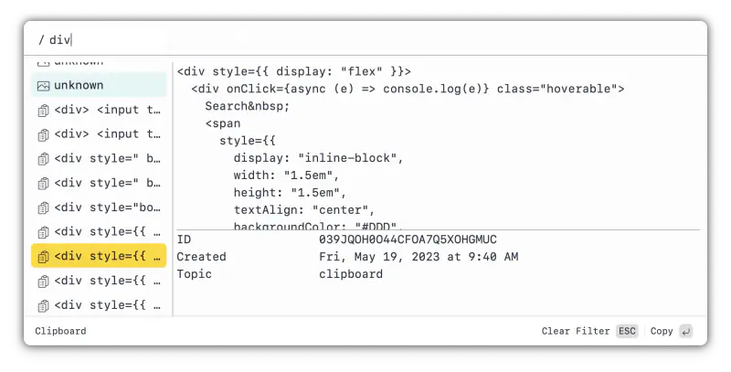
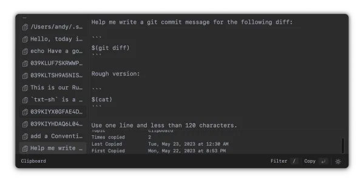

# Tauri + Vanilla


## How to run

```
parcel watch src/index.html --no-hmr --dist-dir ./site
cargo tauri dev

# Type checking:
./scripts/ts-check.sh
```

## Features

### Quick Filter



### Dark Mode



## Todo

### Next

- clean up focus handling
    - reset to start state of 1 minute

- clean up meta panel. add:
    - image info

- page init has become really slow

- handle clipboard images
    - in preview
    - when the user hits enter

- customize key press

- meta-n opens choice: note / command

- add filter: content type
- add filter: number of times copied
