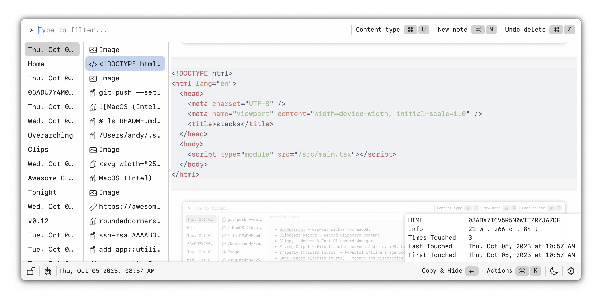

# Stacks

A terrifically capable clipboard manager for macOS. Looking for contributions to expand to Linux and Windows.

## Install

Download the .DMG installers, notarized by Apple for a secure and seamless macOS installation.

- [Apple Silicon](https://github.com/cablehead/stacks/releases/download/v0.10.0/Stacks_0.10.0_aarch64.dmg)
- [Intel](https://github.com/cablehead/stacks/releases/download/v0.10.0/Stacks_0.10.0_x86_64.dmg)

## Usage

### Launch
- To launch Stacks: &#8963;-Space

### Navigation
- Move Down/Up: &#8963;-n / &#8963;-p or arrow keys
- Move Left/Right: &#8963;-h / &#8963;-l or arrow keys

### Item Manipulation
- Move an item Down/Up: &#8984;-Down / &#8984;-Up
- Bring current stack to the top: &#8984;-t
