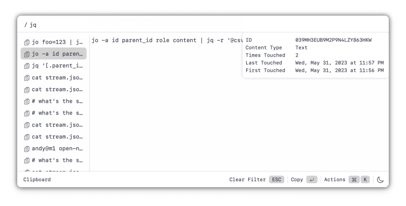
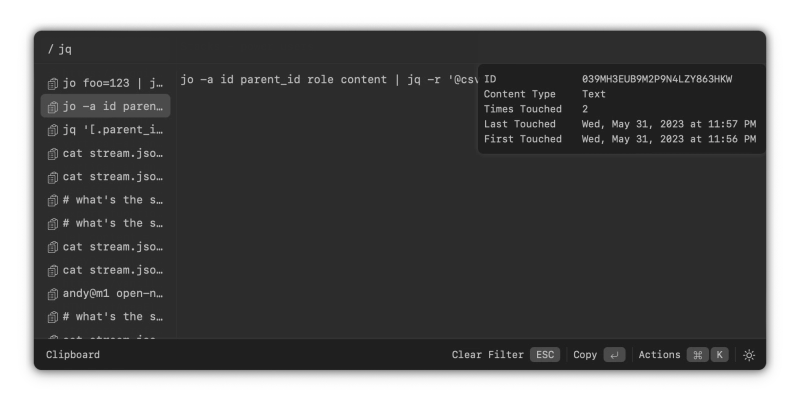
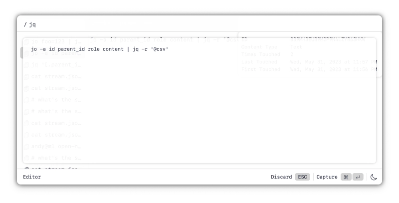

# Stacks

## Features

### Quick Filter



### Dark Mode



### Edit Clippings



## Development

```
npm run tauri dev
# Type checking:
tsc
```

### x-macos-pasteboard

https://github.com/cablehead/workspace/blob/x-macos-pasteboard/Sources/Clip/main.swift

## Release

```
# make sure dev console is disabled

# update Cargo.toml and tauri.conf.json for new version
# set RELEASE to the new version, e.g
RELEASE=v0.5.2

./scripts/build.sh
# while that builds
vi changes/$RELEASE

# after build completes
cat changes/$RELEASE | ./scripts/release.sh

# copy the tempdir created by release.sh to RELEASE_PATH

# commit and push
git commit -a -m "chore: release $RELEASE" && git push

gh release create $RELEASE $RELEASE_PATH/* -n "$(cat changes/$RELEASE)"
```

## Review: Daily/2022-08-11.md

```
"CREATE TABLE IF NOT EXISTS stream (
   id INTEGER PRIMARY KEY,
   source_id INTEGER,
   parent_id INTEGER,

   topic TEXT NOT NULL,

   -- custom to topic (command)
   data TEXT,
   err TEXT,
   code INTEGER NOT NULL
```

## Todo

### Next release

CURRENTLY HERE

- GPT:
    - save settings
    - populate form with current settings
    - add an action to send a stack to GPT
        - stream response?
        - add response to stack

- Track focused Stack backend-side

- New copies / notes go to the currently focused Stack

- Create a new stack

- Restore filter
- Bring back tiktoken count
- Pipe to command

- Rework all commands that write to the clipboard, to update the store first,
  and then ignore the clipboard write (the UI will feel more responsive)

- on Delete:
    - it'd be nice to animate the parent stack moving to the top of the list
    - need to use lastKnown's last_touched to work out how to refocus

- Edit a stack name
    - Should just be an input field, not a textarea

### Stretch

- Ability to order a Stack

- Rework data store to allow for different Stacks to have the same name
    - Want to be able to rename Stacks
    - Bonus: use a backwards compatible serialization format
    - Revert to saving the raw clipboard data, which is mapped to the current
      form
- Add a fork action for stacks

- Investigate macOS clipboard schema when copying files and images in different
  locations

### Direction Change

- Everything happens inside of a Stack. After an hour of inactivity a new
  stack is create for you, with the current timestamp: so the top level is all
  stacks
    - This removes the difference between clipboard items at the root level or
      not: clippings are always in at least one stack
    - We'll still need tooling to copy items between stacks: (link?) (cow?)

### Also

- Write script for testing the app
- Work out a way to document the script in the source code: preferably in a way
  a parser can check
- Perform the script
- Record performing the script
- Slice up the portions of the recording
- Export to various formats: gif (but right), png, video (youtube)?
- Overlay subitles
- Overlay voice over # stretch
- Stand up cross.stream
- Host a page for stacks.cross.stream
- Overview page of Stacks, the app

### Pipe to command

- perserve terminal colors
- streaming responses
- improve display of stderr
- the piped item should be "touched"
- actions to move command or response to the clipboard
- quick filter for previously used commands
- once a command is working well, the ability apply it to a large number of
  items
- access clipbard / stacks inside command editor: Mike, as you've pointed out,
  we need this for the Editor / New note too

### And then

- Status bar shouldn't show any actions when "no matches"

- Clicking trigger in the Actions Modal doesn't trigger the action

- Add directory stack
    - Inside directory stacks you can run commands

- Surface info about the Stack in Meta Panel

- Going to want multi-select to add

- Meta-N opens choice: Note / Shell command
    - We have Note
    - Now need Shell command

- Editor
    - access clips while editor is open

- Preference panel

- Customize key presses: particularly leader key press
- Add activate Stacks (and document keypress) in the menu bar menu.

- Editor capture should create an xs.add row: with parent set to the id the
  editor was triggered on: this should be merged version that's put on the
  clipboard

- mark a clipboard source as don't track (for password managers, etc).
    - see: http://nspasteboard.org

- Meta panel. add: image info

