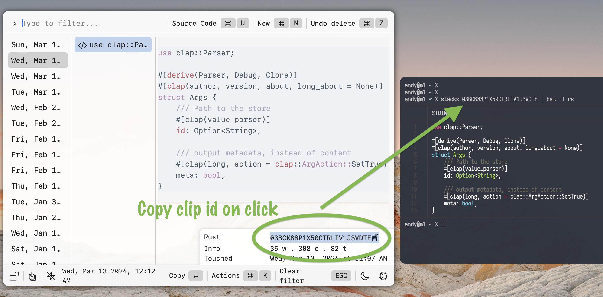

# Stacks

A terrific clipboard manager

## Download

`.DMG` installers that have been notarized by Apple.

## Usage

### Launch
- To launch Stacks: <code>&#8963; + Space</code>

### Navigation
- Move Down/Up: <code>&#8963; + n</code> / <code>&#8963; + p</code> or arrow keys
- Move Left/Right: <code>&#8963; + h</code> / <code>&#8963; + l</code> or arrow keys

### Item Manipulation
- Move an item Down/Up: <code>&#8984; + Dow</code>n / <code>&#8984; + Up</code>
- Bring current stack to the top: <code>&#8984; + t</code>
